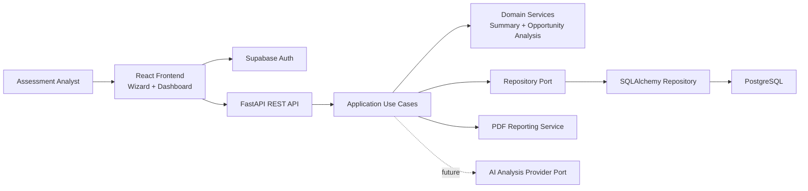

# Architecture Diagram

## Notes

- The React frontend owns data entry, authentication experience, and export actions.
- FastAPI exposes REST endpoints and OpenAPI docs.
- The application layer coordinates persistence, analysis generation, JSON export, and PDF output.
- The domain layer holds rule-based logic today and can be extended with AI-driven analysis later.
